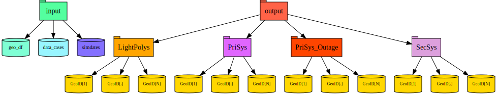

# SAVi

The **S**atellite **A**ccess **Vi**sualization web app

<!-- START doctoc generated TOC please keep comment here to allow auto update -->
<!-- DON'T EDIT THIS SECTION, INSTEAD RE-RUN doctoc TO UPDATE -->
## Table of Contents

- [SAVi Data Diagram](#savi-data-diagram)

<!-- END doctoc generated TOC please keep comment here to allow auto update -->

## SAVi Data Diagram

The below diagram is the data hierarchy within SAVi. Top levels of the hierarchy are input and output. Input contains data about the geolocations and the different output objects available. Output contains different datatypes and the respective objects for each geolocation.

